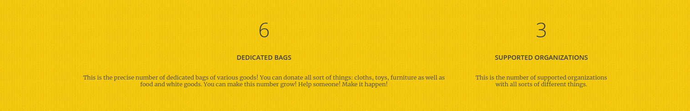
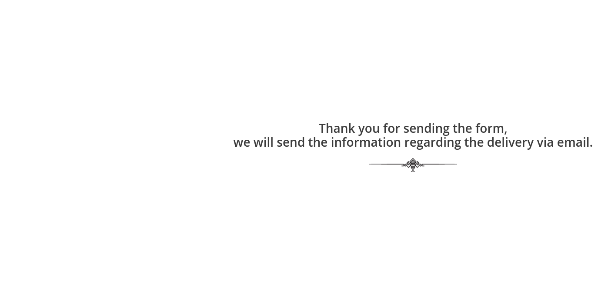

# Charity Donation

## Table of Contents
* [General info](#general-info)
* [Technologies](#technologies)
* [Scope of functionalities](#scope-of-functionalities)
* [Illustrations](#illustrations)
* [Project status](#project-status)

### General info
Application helps to donate various goods to specific charity institutions via a
form. The form is available only for logged users and handled by JavaScript.

### Technologies
Project is created with:
* Python (Django framework)
* HTML
* CSS
* Java Script
* DataBase: PostgreSQL

### Scope of functionalities
* Create a user profile 
* Ability to log through the email (User model modified)
* The number of donated bags and supported institutions updates dynamically basing on the Data Base data
* Logged user is able to access the donation form
* After filling out the form the summary pops up (JavaScript)

### Illustrations
* Main page:

* Create account:

* Log on:

* Dynamic numbers:

* Form:

### Project status
In progress