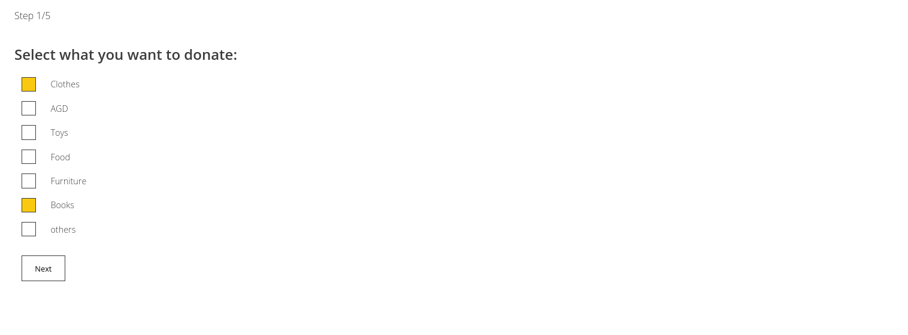
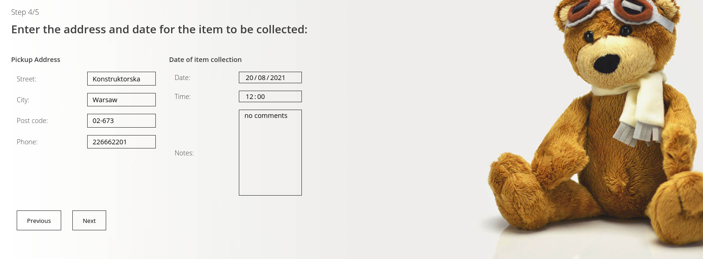

# Charity Donation

# Table of Contents
* [General info](#general-info)
* [Technologies](#technologies)
* [Scope of functionalities](#scope-of-functionalities)
* [Illustrations](#illustrations)
* [Set up](#setup)
* [Project status](#project-status)

## General info
Application helps to donate various goods to specific charity institutions via a
form. The form is available only for logged users and handled by JavaScript.

## Technologies
Project is created with:
* Python: 3.8.10

## Scope of functionalities
* Create a user profile 
* Ability to log through the email (User model modified)
* The number of donated bags and supported institutions updates dynamically basing on the Data Base data
* Logged user is able to access the donation form
* After filling out the form the summary pops up (JavaScript)

## Illustrations
* main page:

* create account:

* log on:

* dynamic numbers:

* form:

## Setup
To run this project, install it locally using pip:

$ cd ../your-dir
$ pip install Django == 3.8.10

And you're good to go!

## Project status
In progress